# SurviveNet – A Disaster Connectivity Platform

SurviveNet is a **real-time disaster management and emergency response mobile application** designed for India.  
It helps citizens stay informed about disasters, locate safe zones, send SOS alerts, connect volunteers & victims and enables authorities to manage disaster data in real time.

---
##  Key Features

|  Real-Time Alerts |  Interactive Map |  SOS System |  User Roles |
|-------------------|------------------|-------------|-------------|
| Live disaster & weather alerts using **OpenWeather API** | City-based disaster maps using **OpenStreetMap** | One-tap SOS call to emergency helpline and contacts | **Victim / Public User** |
| Active & recent disasters | Danger zones visualization | Emergency SMS with live GPS | View disasters |
| India-specific alerts (floods, cyclones, heatwaves) | Safe zones & shelters | Google Maps location link | Contact volunteers |
| Real-time updates | Navigation support | Emergency note included | Navigate to shelters |
|  |  |  | Send SOS alerts |
|  |  |  | Volunteer |
|  |  |  | Contact victims |
|  |  |  | Coordinate rescue efforts |

---
## SurviveNet app screenshots

<table>
  <tr>
    <td>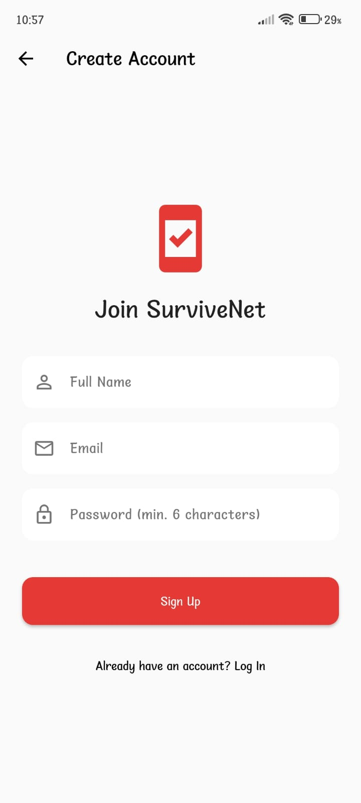</td>
    <td>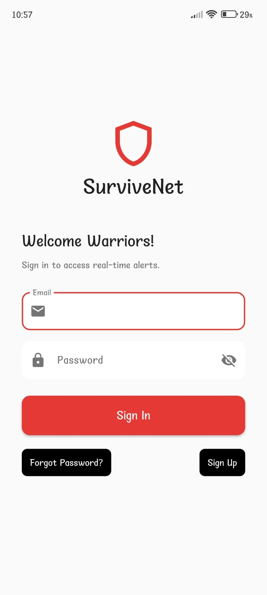</td>
    <td>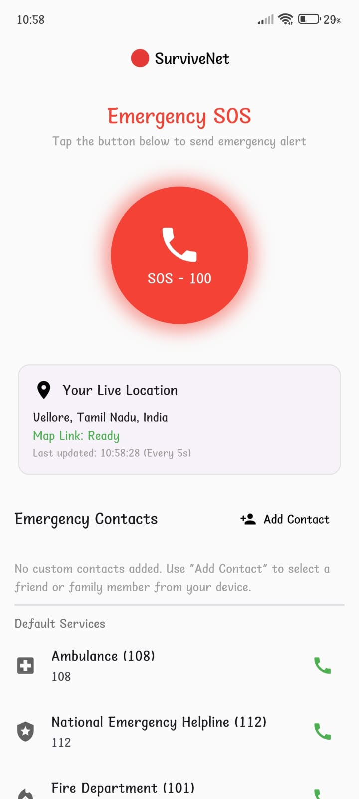</td>
    <td>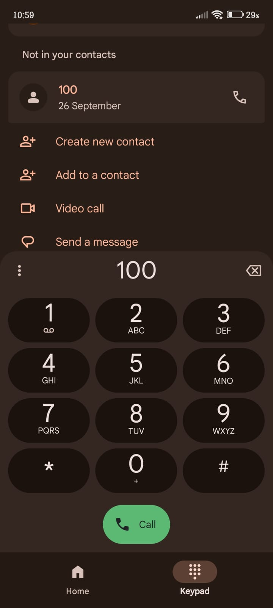</td>

  </tr>
  <tr>
    <td>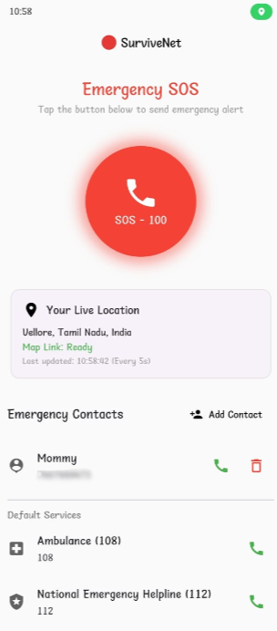</td>
    <td>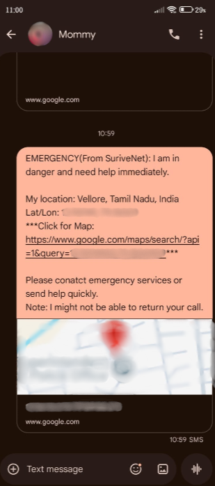</td>
    <td>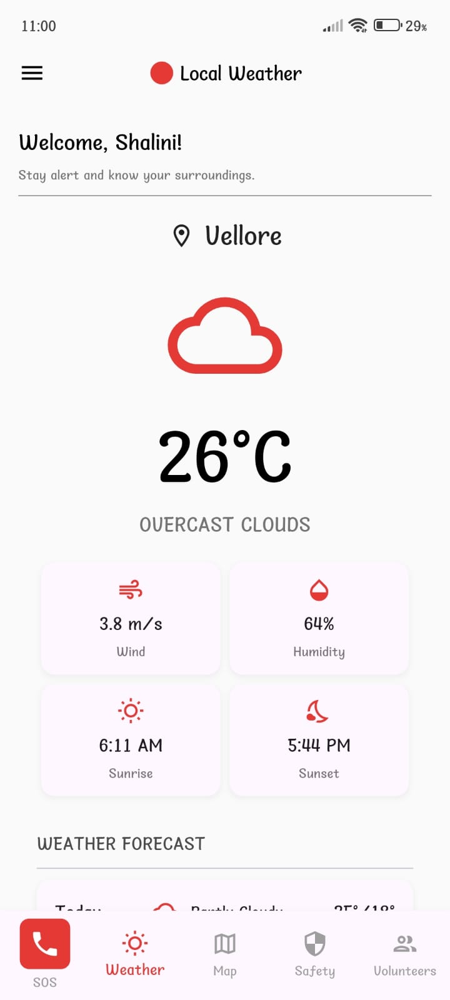</td>
    <td>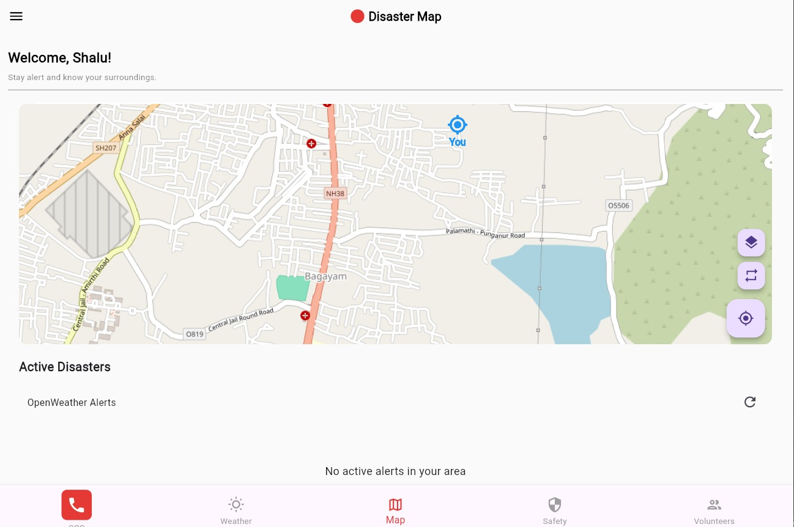</td>
    
  </tr>
  <tr>
    <td>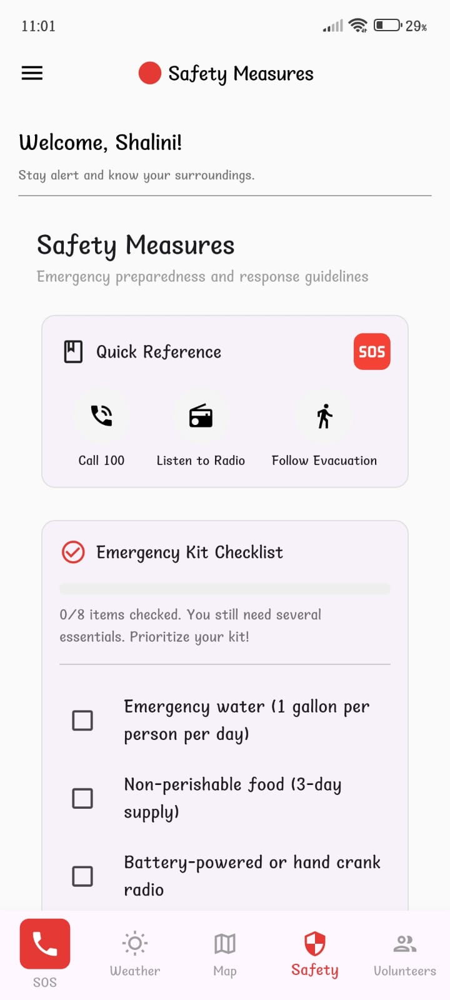</td>
    <td>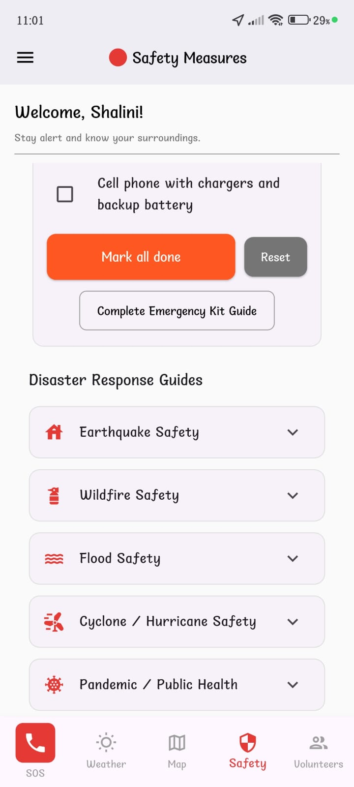</td>
    <td></td>
    <td>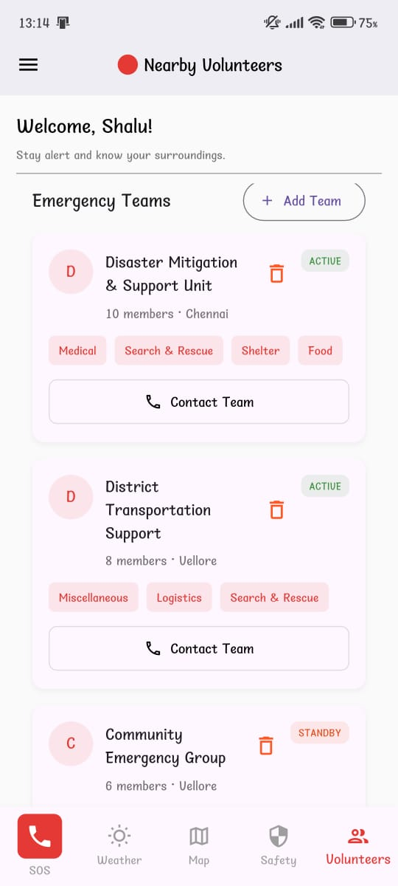</td>
    
  </tr>
  <tr>
    <td>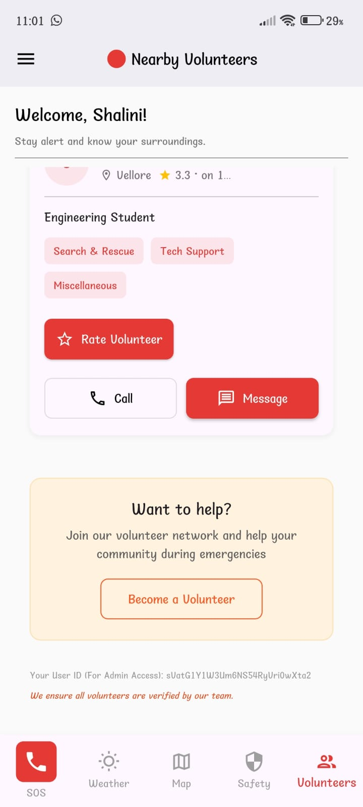</td>
    <td>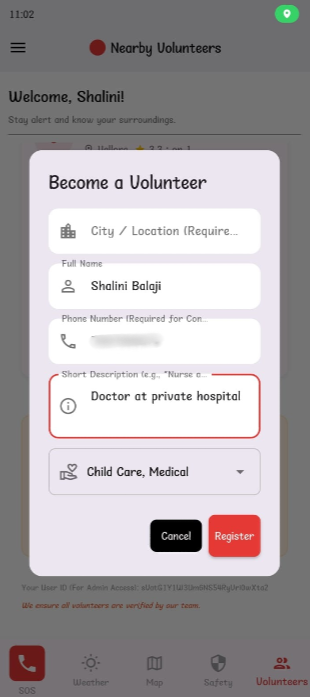</td>
    <td>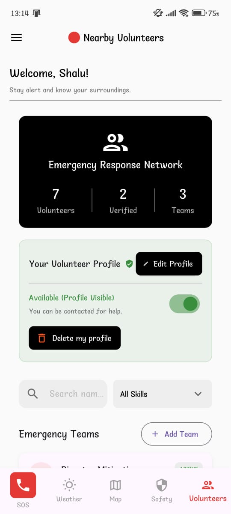</td>
    <td>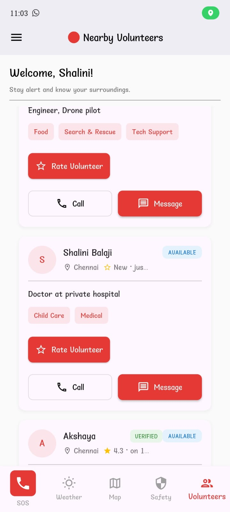</td>
  </tr>
</table>
---

## Tech Stack

| Frontend | Backend & Services |
|----------|--------------------|
| Flutter (Dart) | Firebase Authentication |
| Material UI | OpenWeather and OpenStreetMap |
| flutter_map | Device SMS & Call Intents |
---
##  APIs Used

| API | Purpose |
|----|--------|
| OpenWeather | Weather alerts & disaster warnings |
| OpenStreetMap | Map rendering & navigation |
| Firebase | Auth & real-time database |
---
##  Firebase Setup

1. Create a Firebase project
2. Enable:
   - Authentication → Email/Password
   - Firestore Database
3. Add Android app
4. Download `google-services.json`
5. Place it inside: android/app/google-services.json
---

## Prerequisites
Follow these steps to set up and run the SurviveNet application locally.
Make sure you have the following installed:
   - Flutter SDK (Channel Stable, minimum version 3.0.0+)
   - Dart SDK
   - A connected mobile device or a running emulator/simulator.
   - A Firebase Project set up with Firestore enabled.
---

## Getting started 

1. Clone the repository:
   ```bash
   git clone https://github.com/shalinib-06/SurviveNet
   cd survivenet
2. Install Flutter Dependencies:
   ```bash
   flutter pub get
3. Configure Firebase:
   Follow the official Flutter documentation to add the Firebase configuration files `google-services.json` for Android and `GoogleService-Info.plist` for iOS to their respective directories.
4. Run the application:
   ```bash
   flutter run

